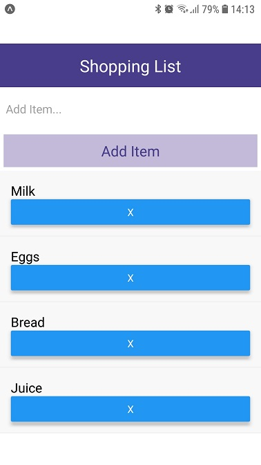

[React Native Crash Course 2020](https://www.youtube.com/watch?v=Hf4MJH0jDb4) - Followed this tutorial to create a basic Shopping List App with `useState`.

**What is React Native?**

React is a framework for creating UIs.

React is agnostic. React-DOM is used to render in the browser.

React Native is a library that compiles react components into native components/widgets. It allows us to use React to create native iOS & Android apps.

This gives us a single codebase :arrow_right: ​Saves time and money.

---

